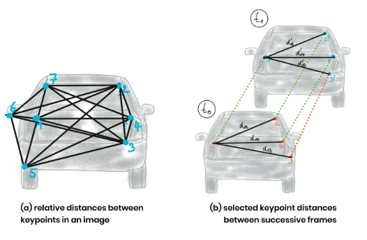

# **Track an Object in 3D Space** 
---

**3D-Object-Tracking-Project**

The goals / steps of this project are the following:
* Match 3D Objects
* Compute Lidar-based TTC
* Associate Keypoint Correspondences with Bounding Boxes
* Compute Camera-based TTC
* Find examples where the TTC estimate of the Lidar sensor does not seem plausible.
* Find out which methods perform best and also include several examples where camera-based TTC estimation is way off. 

## Rubric Points
### Here I will consider the [rubric points](https://review.udacity.com/#!/rubrics/2550/view) individually and describe how I addressed each point in my implementation.  

---
### FP.0 Final Report

#### 1. Provide a Writeup / README that includes all the rubric points and how you addressed each one. You can submit your writeup as markdown or pdf.

The writeup (writeup_report.md) included statement and supporting images that explained how each rubric item was addressed, and specifically where in the code each step was handled.

### FP.1 Match 3D Objects

#### 1. Implement the method "matchBoundingBoxes", which takes as input both the previous and the current data frames and provides as output the ids of the matched regions of interest (i.e. the boxID property). Matches must be the ones with the highest number of keypoint correspondences.

(File : 'camFusion_Student.cpp'; lines : 333-389)
Here, each bounding box is assigned the match candidate with the highest number of occurrences. My approach,
	- loop through each of the bounding boxes in previous frame
	- loop through each of the matches
	- filter out matches belonging to a particular bounding box in previous frame
	- loop throught each of these filtered matches
	- loop through each of the bounding boxes in current frame
	- associate each of the bounding boxes in current frame to their corresponding matched keypoints
	- find out bounding box in current frame having maximum occurences of the matched keypoints
	- associate bounding box from previous frame to the bounding box in current frame
	- repeat the process for each of the bounding boxes in previous frame to associate it with the corresponding bounding box in current frame

##### Sample - Current Frame Bounding Box ID vs Current Frame Keypoint Index

| currFrameBoxId | currFrameKeyPointIdx |
| :------------: | :------------------: |
|       0        |         910          |
|       0        |         922          |
|       0        |         935          |
|     ...        |         ...          |
|       1        |        1420          |
|       1        |        1481          |
|     ...        |         ...          |

##### Analysis :

The above table is for previous frame bounding box ID-0. Now most of matching current frame keypoint indexes were found for current frame box ID-0. Thus, matching pair for box ID for previous frame and current frame would be (0, 0). The same process was repeated for all the bounding boxes for previous frame to obtain corresponding bounding boxes ID of the current frame, as their best matches, as shown in below table.

##### Sample - Bounding Box ID Best Matches for Previous Frame vs Current Frame 

| prevFrameBoxId |    currFrameBoxId    |
| :------------: | :------------------: |
|       0        |           0          |
|       1        |           1          |
|       2        |           2          |
|       3        |           3          |
|       4        |           8          |
|       5        |           5          |

### FP.2 Compute Lidar-based TTC

#### 1. Compute the time-to-collision in second for all matched 3D objects using only Lidar measurements from the matched bounding boxes between current and previous frame.

(File : 'camFusion_Student.cpp'; lines : 282-330)
Here, the code returns the time-to-collision in second using only Lidar measurements. My approach,
	- assume width of the ego lane
	- remove lidar points outside the ego lane, if any
    - store the lidar points in heap data structure
    - sort the lidar points in order
    - choose nearest 200 lidar points to determine their mean location
    - do the same for both previous and current lidar points to find respective closest mean distances
    - calculate time between two measurements in seconds
    - calculate time-to-collision based on equation derived in the tutorial

##### TTC-Lidar calculation equation

<p align = "center">
  
</p>

[Figure taken from Udacity tutorial]

<p align = "center">
  
</p>

[Figure taken from Udacity tutorial]

##### Top-view of Lidar points

<p align = "center">
  
</p>

<p align = "center">
  
</p>

##### Lidar image overlayed with corresponding camera image

<p align = "center">
  
</p>

<p align = "center">
  
</p>

##### Analysis : 

The code is able to deal with outlier Lidar points in a statistically robust way to avoid severe estimation errors. This was achieved by taking 200 closest lidar points, sorting them, calculating their mean values both for previous and current frame, and then using them as mean distance values for closest lidar points in the TTC-Lidar calculation equation.

### FP.3 Associate Keypoint Correspondences with Bounding Boxes

#### 1. Prepare the TTC computation based on camera measurements by associating keypoint correspondences to the bounding boxes which enclose them. All matches which satisfy this condition must be added to a vector in the respective bounding box.

(File : 'camFusion_Student.cpp'; lines : 138-206)
Here, the code adds the keypoint correspondences to the "kptMatches" property of the respective bounding boxes. My approach,
    - loop through each of the keypoint-matches
    - get the keypoint index for current frame using keypoint match
    - get the keypoint for current frame using keypoint index
    - check if bounding box for current frame contains the keypoint
    - get the keypoint index for previous frame using keypoint match
    - get the keypoint for previous frame using keypoint index
    - calculate euclidean distance between keypoints from current frame and previous frame
    - store the euclidean distance in a vector array
    - repeat the same for rest of the keypoint-matches
    - calculate mean value of all the stored euclidean distances
    - loop through each of the keypoint-matches
    - get the keypoint index for current frame using keypoint match
    - get the keypoint for current frame using keypoint index
    - check if bounding box for current frame contains the keypoint
    - get the keypoint index for previous frame using keypoint match
    - get the keypoint for previous frame using keypoint index
    - calculate euclidean distance between keypoints from current frame and previous frame
    - calculate enhanced mean value of all the stored euclidean distances by including a multiplication factor
    - check if the euclidean distance is less than this enhanced mean value
    - store the keypoint for current frame with bounding box for current frame
    - store the keypoint-matches for current frame with bounding box for current frame
    - repeat the same for rest of the keypoint-matches

##### Analysis : 

As it is mentioned above, the outlier matches have been removed based on the euclidean distance between them in relation to all the matches in the bounding box, by keeping only relevant keypoint-matches within mean euclidean distance.


### FP.4 Compute Camera-based TTC

#### 1. Compute the time-to-collision in second for all matched 3D objects using only keypoint correspondences from the matched bounding boxes between current and previous frame.

(File : 'camFusion_Student.cpp'; lines : 209-279)
Here, the code returns the time-to-collision in second using only keypoint correspondences obtained through image frames. My approach,
    - loop through each of the keypoint matches in current frame
    - get current keypoint and its matched partner in the previous frame for outer loop
    - loop through each of the keypoint matches in inner loop
    - set minimum distance for valid keypoint distances in same frame
    - get next keypoint and its matched partner in the prev. frame for inner loop
    - compute distance between keypoints in current frame for outler loop and inner loop
    - compute distance between keypoints in previous frame for outler loop and inner loop
    - check if distances for previous frame and current frame are valid respectively
    - calculate distance ratio using distances from previous frame and current frame
    - store the distance ratio in vector array
    - repeat the same for rest of the keypoint matches in inner loop
    - repeat the same for rest of the keypoint matches in outer loop
    - check if distance ratio vector array contains any value
    - sort distance ratios
    - calculate median distance ratio
    - calculate time between two measurements in seconds
    - calculate TTC based on equation derived in the tutorial

##### TTC-Camera calculation equation

<p align = "center">
  
</p>

[Figure taken from Udacity tutorial]

<p align = "center">
  
</p>

[Figure taken from Udacity tutorial]

<p align = "center">
  
</p>

[Figure taken from Udacity tutorial]

<p align = "center">
  
</p>

[Figure taken from Udacity tutorial]

##### Analysis : 

The code is able to deal with outlier correspondences in a statistically robust way to avoid severe estimation errors. This was achieved by taking all distance ratios, sorting them, calculating their median values, and then using them as median distance ratio in the TTC-Camera calculation equation.

### FP.5 Performance Evaluation 1

#### 1. Find examples where the TTC estimate of the Lidar sensor does not seem plausible. Describe your observations and provide a sound argumentation why you think this happened.

Below are several examples that have been identified and described in detail where TTC estimate of the Lidar sensor did not seem plausible. The assertion was based on manually estimating the distance to the rear of the preceding vehicle from a top view perspective of the Lidar points, and comparing with the calculated TTC for Lidar.

##### Case 1 : TTC-Lidar increased and then decreased, while closest distance decreased

From the Lidar-overlayed camera images below, it is clear that with traffic light being red in the image, the vehicles are slowing down and thus closest lidar point distance for lidar point in the front should be decreasing and thus, time-to-collision should be decreasing as well.

Clealy, from top view of Lidar points, the closest lidar point distance is decreasing in consecutive image frames from 7.91m to 7.79m to 7.64m. But from lidar-overlayed image frame, TTC-Lidar was found to be increasing first from 15.43s to 25.45s, and then decreasing to 17.38s.

<p align = "center">
  
</p>

<p align = "center">
  
</p>

<p align = "center">
  
</p>

<p align = "center">
  
</p>

<p align = "center">
  
</p>

<p align = "center">
  
</p>

##### Analysis : 

From the TTC-Lidar equation below, it is clear that for the closest lidar point distance to decrease, yet TTC-Lidar to increase, would be caused by lower than expected value for difference in mean closest lidar point distance between previous frame and current frame. That could happen when multiple outlier lidar points from further away distance, got selected for the calculation of mean closest lidar point distance in previous frame.

```
double dT = 1.0 / frameRate;
TTC = meanXCurr * dT / (meanXPrev - meanXCurr);
```

To improve the accuracy of TTC-Lidar, one way is to include more points for the calculation of mean closest lidar point distance, so that the effect of outliers point cloud in previous frame get diminished. So, when attempted to calculate mean closest lidar point distance using 200 points instead of 100, the exaggerated time of 25.45s reduced to 19.09s, which sounds a lot more reasonable than earlier estimation.

##### Case 2 : TTC-Lidar decreased and then increased, while closest distance decreased

Clealy, from top view of Lidar points, the closest lidar point distance is decreasing in consecutive image frames from 7.13m to 6.90m to 6.81m. But from lidar-overlayed image frame, TTC-Lidar was found to be decreasing first from 11.33s to 8.46s, and then increasing to 11.42s.

<p align = "center">
  
</p>

<p align = "center">
  
</p>

<p align = "center">
  
</p>

<p align = "center">
  
</p>

<p align = "center">
  
</p>

<p align = "center">
  
</p>

##### Analysis : 

From the TTC-Lidar equation above, it is clear that for the closest lidar point distance to decrease slightly, yet TTC-Lidar to decrease drastically, would be caused by either higher than expected value for difference in mean closest lidar point distance between previous frame and current frame, or very low mean closest lidar point distance for current frame. That could happen when multiple outlier lidar points from quite closer distance got selected for the calculation of mean closest lidar point distance in current frame.

To improve the accuracy of TTC-Lidar, one way is to include more points for the calculation of mean closest lidar point distance, so that the effect of outliers point cloud in previous frame get diminished. So, when attempted to calculate mean closest lidar point distance using 200 points instead of 100, the reduced time of 8.46s increased to 8.58s, which though isn't a major improvement, yet sounds a more reasonable than earlier estimation.

### FP.6 Performance Evaluation 2

#### 1. Run several detector / descriptor combinations and look at the differences in TTC estimation. Find out which methods perform best and also include several examples where camera-based TTC estimation is way off. As with Lidar, describe your observations again and also look into potential reasons.

TOP3 detector / descriptor combinations resulted from previously submitted & reviewed mid-term project - SFND_2D_Feature_Tracking are listed below. They were chosen for their better performance compared to other combinations in terms of accuracy and speed.
	- [1st] FAST + BRIEF
	- [2nd] FAST + ORB
	- [3rd] FAST + BRISK

These detector / descriptor combinations have been compared with regard to the TTC estimate on a frame-by-frame basis. They are represeted in tabular form below, to represent the different TTCs to facilitate comparison.

##### detector + descriptor as FAST + BRIEF

|   Frame No.    |   TTC Lidar    |  TTC Camera    |
| :------------: | :------------: | :------------: |
|      01        |    11.1498     |    10.8098     |
|      02        |    16.3063     |    11.0113     |
|      03        |    19.0932     |    14.1559     |
|      04        |    16.5208     |    14.3886     |
|      05        |    12.6669     |    19.9511     |
|      06        |    13.6635     |    13.293      |
|      07        |    19.7086     |    12.2182     |
|      08        |    19.5118     |    12.7596     |
|      09        |    12.8633     |    12.6        |
|      10        |    15.2587     |    13.4637     |
|      11        |    11.9584     |    13.6717     |
|      12        |    10.8022     |    10.9087     |
|      13        |     9.9619     |    12.3705     |
|      14        |    10.528      |    11.2431     |
|      15        |     8.5814     |    11.8747     |
|      16        |    10.2592     |    11.8398     |
|      17        |    12.986      |     7.9201     |
|      18        |     8.9387     |    11.554      |

##### Observation : 

TTC for Camera was expected to lower frame-by-frame basis. At one time it was observed to go high (14.3886s to 19.9511s when compared from frame 4 to frame 5), before coming back to median value in the consecutive next frame. There, it created a broader gap between TTC from lidar and camera. At another time it was observed to go quite low (11.8398s to 7.9201s when compared from frame 16 to frame 17), before coming back to median value in the consecutive next frame. There again, it creates a broader gap between TTC from lidar and camera. At other times, TTC for camera values are not too far from TTC for lidar (except few instances when TTC Lidar is way off its own median value).

##### detector + descriptor as FAST + ORB

|   Frame No.    |   TTC Lidar    |  TTC Camera    |
| :------------: | :------------: | :------------: |
|      01        |    11.1498     |    11.0315     |
|      02        |    16.3063     |    10.7587     |
|      03        |    19.0932     |    11.4167     |
|      04        |    16.5208     |    12.8338     |
|      05        |    12.6669     |    17.8195     |
|      06        |    13.6635     |    12.9991     |
|      07        |    19.7086     |    11.6025     |
|      08        |    19.5118     |    11.1687     |
|      09        |    12.8633     |    12.1119     |
|      10        |    15.2587     |    13.3473     |
|      11        |    11.9584     |    13.788      |
|      12        |    10.8022     |    10.8955     |
|      13        |     9.9619     |    12.0411     |
|      14        |    10.528      |    10.7303     |
|      15        |     8.5814     |    11.2058     |
|      16        |    10.2592     |    11.1948     |
|      17        |    12.986      |     7.8541     |
|      18        |     8.9387     |    10.6099     |

##### Observation : 

TTC for Camera was expected to lower frame-by-frame basis. At one time it was observed to go high (12.8338s to 17.8195s when compared from frame 4 to frame 5), before coming back to median value in the consecutive next frame. There, it created a broader gap between TTC from lidar and camera. At another time it was observed to go quite low (11.1948s to 7.8541s when compared from frame 16 to frame 17), before coming back to median value in the consecutive next frame. There again, it creates a broader gap between TTC from lidar and camera. At other times, TTC for camera values are not too far from TTC for lidar (except few instances when TTC Lidar is way off its own median value). 


##### detector + descriptor as FAST + BRISK

|   Frame No.    |   TTC Lidar    |  TTC Camera    |
| :------------: | :------------: | :------------: |
|      01        |    11.1498     |    12.489      |
|      02        |    16.3063     |    12.6157     |
|      03        |    19.0932     |    14.2152     |
|      04        |    16.5208     |    12.7138     |
|      05        |    12.6669     |    53.0675     |
|      06        |    13.6635     |    12.1987     |
|      07        |    19.7086     |    17.2645     |
|      08        |    19.5118     |    11.0932     |
|      09        |    12.8633     |    13.2383     |
|      10        |    15.2587     |    12.5274     |
|      11        |    11.9584     |    14.2506     |
|      12        |    10.8022     |    11.436      |
|      13        |     9.9619     |    11.9426     |
|      14        |    10.528      |    12.2277     |
|      15        |     8.58149    |    12.1403     |
|      16        |    10.2592     |    12.463      |
|      17        |    12.986      |     8.5160     |
|      18        |     8.9387     |    11.414      |

##### Observation : 

TTC for Camera was expected to lower frame-by-frame basis. At one time it was observed to go high (12.7138s to 53.0675s when compared from frame 4 to frame 5), before coming back to median value in the consecutive next frame. There, it created a broader gap between TTC from lidar and camera. At another time it was observed to go quite low (12.463s to 8.5160s when compared from frame 16 to frame 17), before coming back to median value in the consecutive next frame. There again, it creates a broader gap between TTC from lidar and camera. At other times, TTC for camera values are not too far from TTC for lidar (except few instances when TTC Lidar is way off its own median value).

##### Analysis & Discussion : 

There is clearly a pattern of spike in TTC camera with value being unexpectedly high from framee 4 to frame 5, and value being unexpectedly low from frame 16 to frame 17. This pattern is consistent to all of our top 3 detector + descriptor combinations.

Spikes in TTC camera values could be because of outlier keypoints which were either incorrectly matched, or whose keypoint-matches were far away from mean distance values, yet got selected. One way to fix the issue would be to further fine-tune minimum required distance for distances for keypoints in both previous and current frames, to ensure only effect of any incorrect keypoint matching is diminished. The other way could be to fine-tune multiplier for enhancing selection range for mean euclidean distance ratio, while clustering keypoint-matches within region-of-interest for corresponding bounding boxes.

